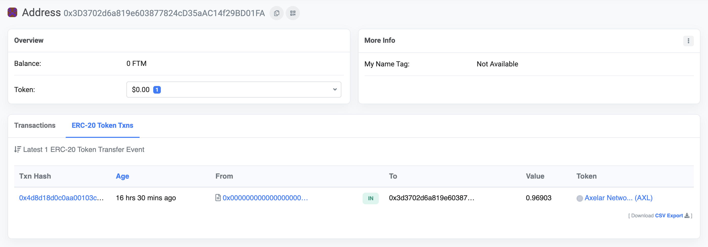

# No commands to sign found

## Problem

In exercise 5 after the step 5 in `Send tokens from Axelar to an EVM chain` when I run 
```bash
axelard tx evm create-pending-transfers [chain] --from validator --gas auto --gas-adjustment 1.2
```
I face the below error
```bash
Error: rpc error: code = InvalidArgument desc = failed to execute message; message index: 0: no commands to sign found: bridge error: invalid request
```

## Cause
Someone has already done it !!

## Solutions

Now there can be two things that can happen:
> [!TIP|style:flat|label:Case1]
> Someone has already created pending-transfers, signed it and has already sent the `execute_data` to the apporpriate evm chain gateway contract

> [!ATTENTION|style:flat|label:Case2]
> Someone has already created pending-transfers, signed it but has not sent the `execute_data` to the apporpriate evm chain gateway contract

### Case 1:
In this case you should already have the token minted to your address. You can verify by checking your linked address on the evm chain explorer.

You should see a minting tx to your address.

**Eg:**
On fantom testnet for address [0x3d3702d6a819e603877824cd35aac14f29bd01fa](https://testnet.ftmscan.com/address/0x3d3702d6a819e603877824cd35aac14f29bd01fa) under ERC-20 Token Txns tab you can see
the minting tx of `AXL` tokens.



In this case you can just you use this txhash in the form field: `A link to mint tx which involves contract interaction on the EVM testnet chain` and resume the exercise.

### Case 2:
In this case someone didn't send the execute_data to the gateway contract, here things get a little tricky

Our objective is to find the `execute_data`

Log in to the `axelar-core` container
```bash
docker exec -it axelar-core sh
```
And type
```bash
axelard query evm latest-batched-commands [your_evm_chain]
```
eg:
```bash
axelard query evm latest-batched-commands fantom
```
You will have a output something like this
```yaml
data: 0000000000000000000000000000000000000000000000000000000000000fa2000000000000000000000000000000000000000000000000000000000000008000000000000000000000000000000000000000000000000000000000000000c000000000000000000000000000000000000000000000000000000000000001400000000000000000000000000000000000000000000000000000000000000001000000000000000000000000000000000000000000000000000000000000001d0000000000000000000000000000000000000000000000000000000000000001000000000000000000000000000000000000000000000000000000000000002000000000000000000000000000000000000000000000000000000000000000096d696e74546f6b656e00000000000000000000000000000000000000000000000000000000000000000000000000000000000000000000000000000000000001000000000000000000000000000000000000000000000000000000000000002000000000000000000000000000000000000000000000000000000000000000a00000000000000000000000000000000000000000000000000000000000000060000000000000000000000000a7abdf66fe785807133d6547a19ea4d1f714f99f00000000000000000000000000000000000000000000000000000000001e7cb0000000000000000000000000000000000000000000000000000000000000000341584c0000000000000000000000000000000000000000000000000000000000
execute_data: 09c5eabe000000000000000000000000000000000000000000000000000000000000002000000000000000000000000000000000000000000000000000000000000009a0000000000000000000000000000000000000000000000000000000000000004000000000000000000000000000000000000000000000000000000000000002a000000000000000000000000000000000000000000000000000000000000002400000000000000000000000000000000000000000000000000000000000000fa2000000000000000000000000000000000000000000000000000000000000008000000000000000000000000000000000000000000000000000000000000000c000000000000000000000000000000000000000000000000000000000000001400000000000000000000000000000000000000000000000000000000000000001000000000000000000000000000000000000000000000000000000000000001d0000000000000000000000000000000000000000000000000000000000000001000000000000000000000000000000000000000000000000000000000000002000000000000000000000000000000000000000000000000000000000000000096d696e74546f6b656e00000000000000000000000000000000000000000000000000000000000000000000000000000000000000000000000000000000000001000000000000000000000000000000000000000000000000000000000000002000000000000000000000000000000000000000000000000000000000000000a00000000000000000000000000000000000000000000000000000000000000060000000000000000000000000a7abdf66fe785807133d6547a19ea4d1f714f99f00000000000000000000000000000000000000000000000000000000001e7cb0000000000000000000000000000000000000000000000000000000000000000341584c0000000000000000000000000000000000000000000000000000000000000000000000000000000000000000000000000000000000000000000000000b000000000000000000000000000000000000000000000000000000000000016000000000000000000000000000000000000000000000000000000000000001e0000000000000000000000000000000000000000000000000000000000000026000000000000000000000000000000000000000000000000000000000000002e0000000000000000000000000000000000000000000000000000000000000036000000000000000000000000000000000000000000000000000000000000003e0000000000000000000000000000000000000000000000000000000000000046000000000000000000000000000000000000000000000000000000000000004e0000000000000000000000000000000000000000000000000000000000000056000000000000000000000000000000000000000000000000000000000000005e000000000000000000000000000000000000000000000000000000000000006600000000000000000000000000000000000000000000000000000000000000041efbf6a9ed36329f764b00d9072389c64dffeb13bd336b3342c5614e30272474c520dc4f8e0c7fb22d47a8b15d92a1e5ac25d9a6827277a7a4757f70d41c74bc11b0000000000000000000000000000000000000000000000000000000000000000000000000000000000000000000000000000000000000000000000000000413e4a3f19c27b81ce227cf68fd82cf9043c9c482c274137a502ca4c8ba3ee56122b0dd5de67e095671b402893893401c8ca40fee7a74e2d5a7ba8f50d2e6375b91b00000000000000000000000000000000000000000000000000000000000000000000000000000000000000000000000000000000000000000000000000004155ec642bcf4cd4763b29dc2e7d09ba9886ef70520648aac44090b107a0a29f1f2e1fa5020995f9e88e93ffb9e1314666ca732c958934414be66b533fe50547251b00000000000000000000000000000000000000000000000000000000000000000000000000000000000000000000000000000000000000000000000000004169805c07118edb56fbb9ce6d7596fa117de0a64d427243bd2dac3966d4314e4a0463448d002cc264ed08f59a1aa0f4be23f7036cc899fa91c72db32c048eb37f1b000000000000000000000000000000000000000000000000000000000000000000000000000000000000000000000000000000000000000000000000000041ccd6c037ee92cbe3464fff90872716cc21d67ca20d291bb0ec446e8bc11c855a0b4cf1db0b3ab2fecdf07a980091313103b53a284f516b36ca05c64eea56be791c0000000000000000000000000000000000000000000000000000000000000000000000000000000000000000000000000000000000000000000000000000419c45f9bfca5657f76da42ee207cc361360e03873cc38b32ac8f4db8c12b8307e0cd7fb1958d5f89641636c649ed92f0997a030048a8bb39d9e85407cc3346cdf1c000000000000000000000000000000000000000000000000000000000000000000000000000000000000000000000000000000000000000000000000000041e2a00cf1585a2bee655eae93e1a7209c963b878e5945d767dd313629b5cb09fc36f0d65b3aeb5b68fd59a6ce20543a5a3f23b4218266abf89ffb9b3185d912d51b000000000000000000000000000000000000000000000000000000000000000000000000000000000000000000000000000000000000000000000000000041568973c30831041edca059ba4d01ef8b51c78393c2510c173ff0a4e2a8bcac5e76457bd607c7a7c9f485a084ce4d83349161cd862cdd98490e01cf02417cd9351b000000000000000000000000000000000000000000000000000000000000000000000000000000000000000000000000000000000000000000000000000041ac3e1fb59d8d12d064822b137c72d053d82f6205acfc579535c17dc561fdbce43d4f8268310c6c1bcb185cf8ef22471145d2a49ba330126180f502962d146b2b1b0000000000000000000000000000000000000000000000000000000000000000000000000000000000000000000000000000000000000000000000000000417d8bf092f269effc593d18ef77d9982520c7c6a5ea6d08645217da3a9283ddb8767f5fcd03c0432a3c3b48e92117423a8896270de80f358e9976ca3fb54203511c000000000000000000000000000000000000000000000000000000000000000000000000000000000000000000000000000000000000000000000000000041a303282f3a9c850b54d191a2a8fefcd7827da28264858b6f716c4a9a158968d64584be50493b22bb3b713e3560c7f9f3e2e3cae22b2fcf4b84cba0dc42f4a57b1c00000000000000000000000000000000000000000000000000000000000000
id: a6562a0ad886ee0f8234888870c2c4bed4938ef81c0795a977cfb121d0ecef69
key_id: fantom-secondary-b02b5f45-4
prev_batched_commands_id: eb06a46a8d3faa23f1fe216c4996f3322356396069272d883155c2e4d13bbbb2
signature:
- efbf6a9ed36329f764b00d9072389c64dffeb13bd336b3342c5614e30272474c520dc4f8e0c7fb22d47a8b15d92a1e5ac25d9a6827277a7a4757f70d41c74bc100
- 3e4a3f19c27b81ce227cf68fd82cf9043c9c482c274137a502ca4c8ba3ee56122b0dd5de67e095671b402893893401c8ca40fee7a74e2d5a7ba8f50d2e6375b900
- 55ec642bcf4cd4763b29dc2e7d09ba9886ef70520648aac44090b107a0a29f1f2e1fa5020995f9e88e93ffb9e1314666ca732c958934414be66b533fe505472500
- 69805c07118edb56fbb9ce6d7596fa117de0a64d427243bd2dac3966d4314e4a0463448d002cc264ed08f59a1aa0f4be23f7036cc899fa91c72db32c048eb37f00
- ccd6c037ee92cbe3464fff90872716cc21d67ca20d291bb0ec446e8bc11c855a0b4cf1db0b3ab2fecdf07a980091313103b53a284f516b36ca05c64eea56be7901
- 9c45f9bfca5657f76da42ee207cc361360e03873cc38b32ac8f4db8c12b8307e0cd7fb1958d5f89641636c649ed92f0997a030048a8bb39d9e85407cc3346cdf01
- e2a00cf1585a2bee655eae93e1a7209c963b878e5945d767dd313629b5cb09fc36f0d65b3aeb5b68fd59a6ce20543a5a3f23b4218266abf89ffb9b3185d912d500
- 568973c30831041edca059ba4d01ef8b51c78393c2510c173ff0a4e2a8bcac5e76457bd607c7a7c9f485a084ce4d83349161cd862cdd98490e01cf02417cd93500
- ac3e1fb59d8d12d064822b137c72d053d82f6205acfc579535c17dc561fdbce43d4f8268310c6c1bcb185cf8ef22471145d2a49ba330126180f502962d146b2b00
- 7d8bf092f269effc593d18ef77d9982520c7c6a5ea6d08645217da3a9283ddb8767f5fcd03c0432a3c3b48e92117423a8896270de80f358e9976ca3fb542035101
- a303282f3a9c850b54d191a2a8fefcd7827da28264858b6f716c4a9a158968d64584be50493b22bb3b713e3560c7f9f3e2e3cae22b2fcf4b84cba0dc42f4a57b01
status: BATCHED_COMMANDS_STATUS_SIGNED
```
It should have `execute_data`, take that data and send it to gateway contract - basically resume from step 7 in `Send tokens from Axelar to an EVM chain`

If after this you get the token on your address - Congrats !

If not - take the `prev_batched_commands_id` from the above output that you just got and query it using
```bash
axelard q evm batched-commands [chain] [batched commands id]
```

Eg:
```yaml
data: 0000000000000000000000000000000000000000000000000000000000000fa2000000000000000000000000000000000000000000000000000000000000008000000000000000000000000000000000000000000000000000000000000000c00000000000000000000000000000000000000000000000000000000000000140000000000000000000000000000000000000000000000000000000000000000100000000000000000000000000000000000000000000000000000000000000170000000000000000000000000000000000000000000000000000000000000001000000000000000000000000000000000000000000000000000000000000002000000000000000000000000000000000000000000000000000000000000000096d696e74546f6b656e00000000000000000000000000000000000000000000000000000000000000000000000000000000000000000000000000000000000001000000000000000000000000000000000000000000000000000000000000002000000000000000000000000000000000000000000000000000000000000000a000000000000000000000000000000000000000000000000000000000000000600000000000000000000000001df919d7cf2d9bb62cd46aec1b1bed9bb3e8a20200000000000000000000000000000000000000000000000000000000000ec946000000000000000000000000000000000000000000000000000000000000000341584c0000000000000000000000000000000000000000000000000000000000
execute_data: 09c5eabe000000000000000000000000000000000000000000000000000000000000002000000000000000000000000000000000000000000000000000000000000009a0000000000000000000000000000000000000000000000000000000000000004000000000000000000000000000000000000000000000000000000000000002a000000000000000000000000000000000000000000000000000000000000002400000000000000000000000000000000000000000000000000000000000000fa2000000000000000000000000000000000000000000000000000000000000008000000000000000000000000000000000000000000000000000000000000000c00000000000000000000000000000000000000000000000000000000000000140000000000000000000000000000000000000000000000000000000000000000100000000000000000000000000000000000000000000000000000000000000170000000000000000000000000000000000000000000000000000000000000001000000000000000000000000000000000000000000000000000000000000002000000000000000000000000000000000000000000000000000000000000000096d696e74546f6b656e00000000000000000000000000000000000000000000000000000000000000000000000000000000000000000000000000000000000001000000000000000000000000000000000000000000000000000000000000002000000000000000000000000000000000000000000000000000000000000000a000000000000000000000000000000000000000000000000000000000000000600000000000000000000000001df919d7cf2d9bb62cd46aec1b1bed9bb3e8a20200000000000000000000000000000000000000000000000000000000000ec946000000000000000000000000000000000000000000000000000000000000000341584c0000000000000000000000000000000000000000000000000000000000000000000000000000000000000000000000000000000000000000000000000b000000000000000000000000000000000000000000000000000000000000016000000000000000000000000000000000000000000000000000000000000001e0000000000000000000000000000000000000000000000000000000000000026000000000000000000000000000000000000000000000000000000000000002e0000000000000000000000000000000000000000000000000000000000000036000000000000000000000000000000000000000000000000000000000000003e0000000000000000000000000000000000000000000000000000000000000046000000000000000000000000000000000000000000000000000000000000004e0000000000000000000000000000000000000000000000000000000000000056000000000000000000000000000000000000000000000000000000000000005e00000000000000000000000000000000000000000000000000000000000000660000000000000000000000000000000000000000000000000000000000000004145252f38de1d02f51642c1b4b8c3fe847e8796cd570b2eadd8f978380ab2d5571dc0c357722c2be296296f4b91deabbd64fd3965829939edf7e760e20b1b11be1b000000000000000000000000000000000000000000000000000000000000000000000000000000000000000000000000000000000000000000000000000041db84d7158d4c5d4ea179bfc3f055877b77dd6d26645f8706d2acf75473618fee6dbf9b806f862ba2db5faa787e82eb85533c9b7d7a8d118771603cc5d2c110ca1c000000000000000000000000000000000000000000000000000000000000000000000000000000000000000000000000000000000000000000000000000041337bb7e49057e4a69ae578db33f83da46c787ff8dad6df83cea16840b9f5e91e6bd2e0db69ae1ebd263e14146699b5b23e0d72e4bbc6be2de382ca07f55b617d1b000000000000000000000000000000000000000000000000000000000000000000000000000000000000000000000000000000000000000000000000000041e50b4c13e45a4f60d6656709234e8d08d98d12b6246e2be232e54a499ac4244316e0a71988c6c9ae97a0e3a5d2b3ae4c4882a3943c6358164dcdc6273701b1491c000000000000000000000000000000000000000000000000000000000000000000000000000000000000000000000000000000000000000000000000000041d0863f483c64530fc2539d49cc7c7afcfe8be18d6fb77b9e549f6563ba2db9473d5ff28555d8c84b1fb2c5813fe609689c41a44a3fbb09b2d0462667fd0c793c1c000000000000000000000000000000000000000000000000000000000000000000000000000000000000000000000000000000000000000000000000000041ab9ccc125544b43506269e285c3192c441519f03177061fce349d639dafbaf39016d3916d412ed6d629682560c59639e315ef045b1ee493dd5060dec4b4cff1e1b000000000000000000000000000000000000000000000000000000000000000000000000000000000000000000000000000000000000000000000000000041ddf50eddf83d91c6ada2d3b98fafb786347cbf1f73929c7d833c5c5780918fa518bfd86bb1e12d5066a24ece0cd25186d743977a0ba31928db6d7134449025101c000000000000000000000000000000000000000000000000000000000000000000000000000000000000000000000000000000000000000000000000000041aed3cd21924eadadba484f040415e063c0bd7d158749e91627f5bc3e0424a186495ca5b868c606b85e15f16e3043302a3ca2693f67a527da515cc17685f9920f1c0000000000000000000000000000000000000000000000000000000000000000000000000000000000000000000000000000000000000000000000000000413a8e0a829e5b18e99e4db0925ccdf15fb496fbfc8d907add8c2caf5d283c3a072022720a443c62b4f8aa5a98d7dfc65da7e88db7d5145ddd2e496871fd8f3f6f1b00000000000000000000000000000000000000000000000000000000000000000000000000000000000000000000000000000000000000000000000000004140711a77d5790b2a8833fe933c61b2f58852d63028aca27c9f20f6ee9020340b406c6609886285c32572cf3f3abca5a5a2060f5065309a3ec3c9c343abd0eb641b000000000000000000000000000000000000000000000000000000000000000000000000000000000000000000000000000000000000000000000000000041ba274c610a08d60d26e13e596a0e736ce9347696e6aa0c3372f3b04120229e936370ea347f73f667027ca29a244393bb446b233f2fcd30745e8ac225e9c563111c00000000000000000000000000000000000000000000000000000000000000
id: eb06a46a8d3faa23f1fe216c4996f3322356396069272d883155c2e4d13bbbb2
key_id: fantom-secondary-b02b5f45-4
prev_batched_commands_id: 904922911bb5ff5eaab4bcf1f045dbe29d449d5d2d06e264b803775703b555ed
signature:
- 45252f38de1d02f51642c1b4b8c3fe847e8796cd570b2eadd8f978380ab2d5571dc0c357722c2be296296f4b91deabbd64fd3965829939edf7e760e20b1b11be00
- db84d7158d4c5d4ea179bfc3f055877b77dd6d26645f8706d2acf75473618fee6dbf9b806f862ba2db5faa787e82eb85533c9b7d7a8d118771603cc5d2c110ca01
- 337bb7e49057e4a69ae578db33f83da46c787ff8dad6df83cea16840b9f5e91e6bd2e0db69ae1ebd263e14146699b5b23e0d72e4bbc6be2de382ca07f55b617d00
- e50b4c13e45a4f60d6656709234e8d08d98d12b6246e2be232e54a499ac4244316e0a71988c6c9ae97a0e3a5d2b3ae4c4882a3943c6358164dcdc6273701b14901
- d0863f483c64530fc2539d49cc7c7afcfe8be18d6fb77b9e549f6563ba2db9473d5ff28555d8c84b1fb2c5813fe609689c41a44a3fbb09b2d0462667fd0c793c01
- ab9ccc125544b43506269e285c3192c441519f03177061fce349d639dafbaf39016d3916d412ed6d629682560c59639e315ef045b1ee493dd5060dec4b4cff1e00
- ddf50eddf83d91c6ada2d3b98fafb786347cbf1f73929c7d833c5c5780918fa518bfd86bb1e12d5066a24ece0cd25186d743977a0ba31928db6d71344490251001
- aed3cd21924eadadba484f040415e063c0bd7d158749e91627f5bc3e0424a186495ca5b868c606b85e15f16e3043302a3ca2693f67a527da515cc17685f9920f01
- 3a8e0a829e5b18e99e4db0925ccdf15fb496fbfc8d907add8c2caf5d283c3a072022720a443c62b4f8aa5a98d7dfc65da7e88db7d5145ddd2e496871fd8f3f6f00
- 40711a77d5790b2a8833fe933c61b2f58852d63028aca27c9f20f6ee9020340b406c6609886285c32572cf3f3abca5a5a2060f5065309a3ec3c9c343abd0eb6400
- ba274c610a08d60d26e13e596a0e736ce9347696e6aa0c3372f3b04120229e936370ea347f73f667027ca29a244393bb446b233f2fcd30745e8ac225e9c5631101
status: BATCHED_COMMANDS_STATUS_SIGNED
```
Try using the `execute_data` from this, if you get the tokens - Congrats

If not - repeat the same process recursively: query `prev_batched_commands_id`and check again.