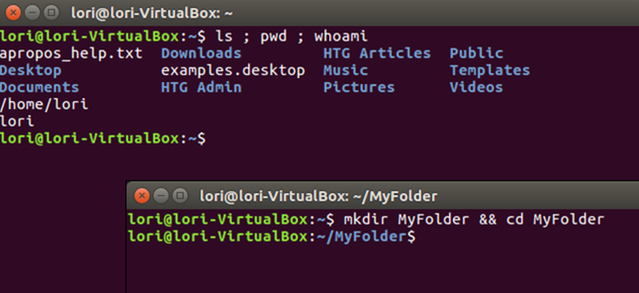

# Resources
-----

<!-- panels:start -->

<!-- div:right-panel -->
   

  <a href="../#/resources/testnet-releases">

       
<h1>Testnet Releases</h1>

  </a>
  

  

<!-- div:right-panel -->

  <a href="../#/resources/extra-commands">

       
<h1>Extra Commands</h1>

  </a>
  

<!-- div:right-panel -->

  <a href="../#/resources/useful-links">

       
<h1>Useful links</h1>

  </a>
  

<!-- div:right-panel -->

<!-- panels:end -->