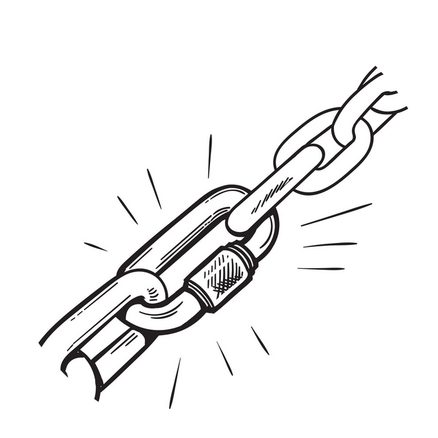
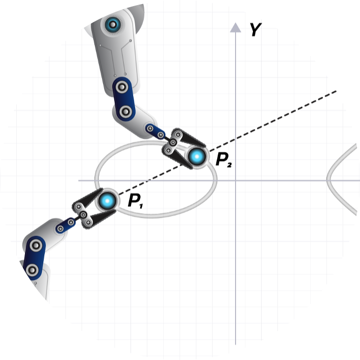

# Validator Zone
-----

<!-- panels:start -->

<!-- div:right-panel -->

<a href="../#/validator-zone/setup/setup-homepage">

   
<h1>Validator Setup</h1>

</a>

<!-- div:right-panel -->

<a href="../#/validator-zone/external-chains/external-chains-homepage">

   
<h1>Setup External Chains</h1>

</a>

<!-- div:right-panel -->

<a href="../#/validator-zone/troubleshoot/troubleshoot-homepage">

     
<h1>Troubleshoot</h1>

</a>

<!-- div:right-panel -->

<!-- panels:end -->